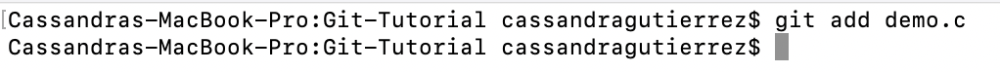
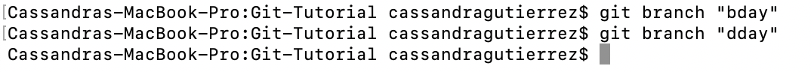

# Git-Tutorial 
## What's git? 
Git is the most popular version control system in today’s world. Version control systems are software tools that allow you to manage and track changes made to files. Git runs locally and is accessible via command line (terminal). This means you can manage, track, and store your files on your local machine. Git is most commonly used with [Github](https://github.com), the online website that hosts your Git projects (or repositories) remotely. It is widely used because it allows for the non-linear, simultaneous collaboration on projects from anywhere, since repositories on Github can be accessed by others. 

In other words, Git is used to track and manage changes to files. This allows multiple people to work on the same project, at the same time, without impedeing on each other's work. This tutorial will go over the basic concepts needed to start using Git including cloning, branches, stashes, merges, and conflicts.

## Getting Started: Cloning 

We will be using a demo project for this tutorial. To get started, you will need to access the project located in the [Github repository](https://github.com/cassgtz/Git-Tutorial.git) and copy it onto your local machine. This is called **cloning**. 

**How to Clone a GitHub Repository:** 
1. Copy the URL in GitHub

2. Use the command `git clone <URL>` & hit enter
  
    This creates a folder in your local machine with the same name as the Github repository. 
  
    

Now you have the repository Git-Tutorial in your local machine. Let’s open up the demo.c file that is in Git-Tutorial. We will make changes to it in order to demonstrate the different git commands and concepts in this tutorial. 

## Commits
**Commit** is a Git command that saves changes in your repository. It is often described as a snapshot of your repository at the time you made the commit. Each commit takes a message as a way to label/track changes. 
Think of Google Docs as a comparison. When you look at the version history of a Google Doc, there are various timestamps that each correspond to a different version of the doc at the time that you saved it. A commit is just like saving a doc’s version with the commit’s message being the timestamp.

**Process of committing changes:** 

1. Working directory: First you must make changes on your local machine. These changes only exist locally on your machine and are not reflected anywhere else. 

    Make a change to the file demo.c: Comment out the statement on line 5. 
    
    

2. Staging directory: When you are finished making changes, you must first add them to your staging directory. Think of this as you applying the changes to your repository but not yet saving them. 
    
    Add changes to staging directory by using the command `git add <FILENAME>` & hit enter
  
    

3. Commit: Once you are ready to save all the changes, do the commit command. This will reflect all changes in your repository. 

    Commit changes by using the command `git commit -m “MESSAGE”` & hit enter
  
    
    
This created a commit with the message "Removed Statement". The commited changes are now stored in the repository. 

## Branches
**Branching** is the most essential concept of git because it is what allows for non-linear development of projects. It the process of creating copies (branches) of objects in order to build upon them. Creating a branch craetes a pointer to a commit. In short, branches result in different versions of the same file for the purpose of isolating new changes without affecting original versions. 

When you initialize a repository, git automatically creates a default branch named "main". From the main branch, you can create as many branches as you can.

**How to create a branch:** 
1. Move into the desired branch that you want the new branch to copy using the command `git checkout <BRANCH NAME>` 
2. Create branch using the command `git branch “NAME OF BRANCH”`

Let's create 2 branches to work with. Create a "bday" & a "dday" branch that branch out from main branch: 

Now, let’s make changes in each branch & commit them. 

Bday branch:
  
  * To access the branch, move into it: `git checkout <BRANCH NAME>`
  * Copy this exact same code into the bday demo.c:
 
  * Commit changes!
  
Dday branch:

  * move into dday branch: `get checkout <BRANCH NAME>`
  * Copy this exact same code into the dday demo.c:
  * Commit changes!

Now, all three branches (main, bday, and dday) have different versions of the demo.c file. You may continue to create branches off of any branch by checkouting out at the source branch first, then creating the new branch. 

